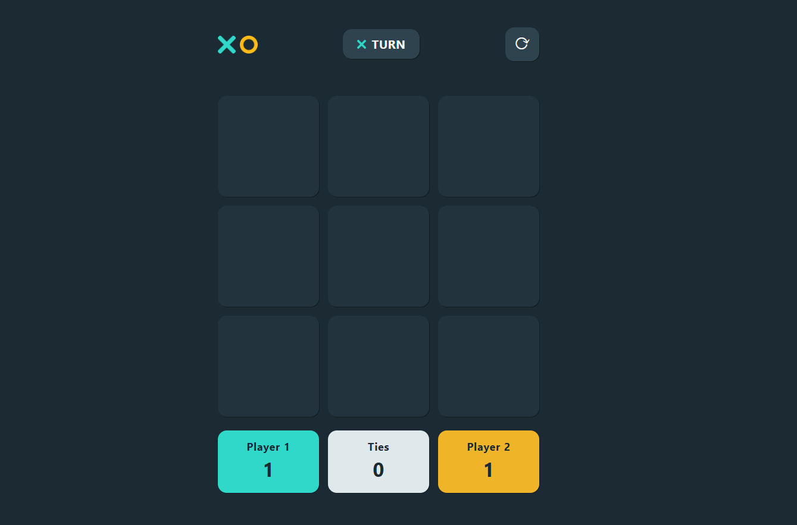
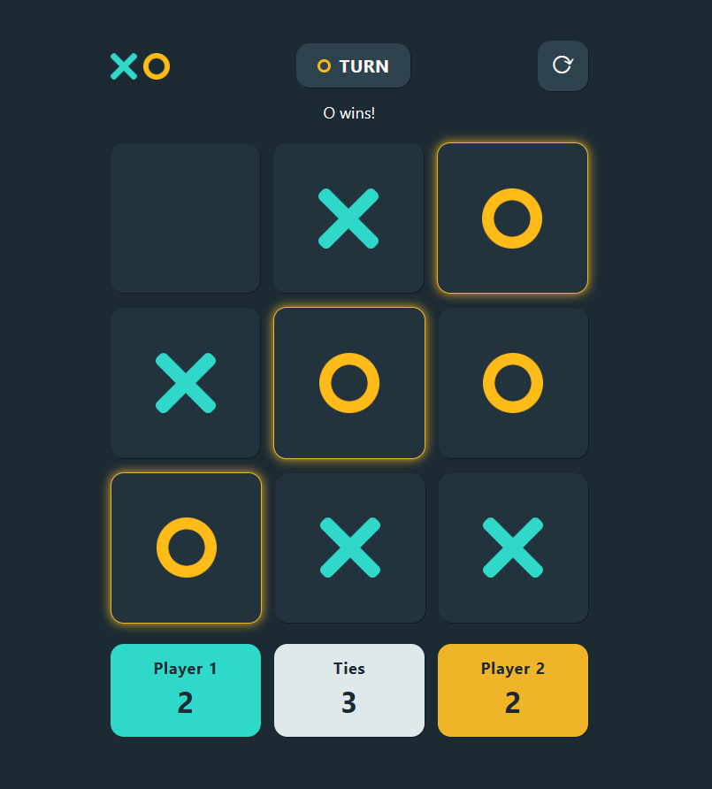

# 🎮 Tic-Tac-Toe Game

A clean, browser-based Tic-Tac-Toe game built with Flask, JavaScript, HTML, and CSS. The Flask backend manages the game state and validates each move, while the frontend provides an interactive board, turn indicator, status messages, winning-cell highlights, reset control, and scoreboard.

## 🌐 Live Demo

https://your-app.onrender.com

## 📸 Preview

  ### Game Board

  

  ### Winner Screen

  

## ✨ Features

- Interactive 3x3 Tic-Tac-Toe board
- Two-player local gameplay with alternating `X` and `O` turns
- Server-side move validation and win/draw detection
- Score tracking for Player 1, Player 2, and ties
- Reset button to start a new round without clearing the scoreboard
- Winning-line highlighting after a player wins
- Turn indicator that switches between the `X` and `O` icons
- Responsive, polished game UI with custom image assets
- JSON API endpoints for move handling and game reset

## 🛠️ Tech Stack

- Python
- Flask
- JavaScript
- HTML5
- CSS3

## 📁 Project Structure

```text
.
|-- app.py
|-- game.py
|-- requirements.txt
|-- readme.md
|-- static
|   |-- script.js
|   |-- style.css
|   `-- images
|       |-- circle.png
|       |-- cross.png
|       |-- refresh-arrow.png
|       `-- tic-tac-toe.png
`-- templates
    `-- index.html
```

## Getting Started

### Prerequisites

- Python 3.10 or newer
- `pip`

### ⚙️ Installation

1. Clone or download the project.

2. Move into the project directory:

```bash
cd "Tic Tac Toe"
```

3. Create a virtual environment:

```bash
python -m venv .venv
```

4. Activate the virtual environment:

```bash
# Windows
.venv\Scripts\activate

# macOS/Linux
source .venv/bin/activate
```

5. Install dependencies:

```bash
pip install -r requirements.txt
```

## Running the App

Start the Flask development server:

```bash
python app.py
```

Then open the app in your browser:

```text
http://127.0.0.1:5000
```

## 🎮 How It Works

- `app.py` defines the Flask routes and connects the frontend to the game logic.
- `game.py` stores the board state, current turn, win detection, draw detection, and reset behavior.
- `templates/index.html` renders the game interface.
- `static/script.js` sends moves to the backend using `fetch()`, updates the board dynamically, tracks scores in the browser, and highlights winning cells.
- `static/style.css` handles the visual layout and styling.

## API Endpoints

### `GET /`

Renders the Tic-Tac-Toe board and resets the game state.

### `POST /move`

Accepts a selected cell and returns the result of the move.

Request body:

```json
{
  "cell": "1"
}
```

Example response:

```json
{
  "valid": true,
  "symbol": "X",
  "winner": null,
  "winning_line": null,
  "draw": false
}
```

When a player wins, `winning_line` contains the three zero-based board indexes that should be highlighted.

### `POST /reset`

Resets the board and starts a new round.

Example response:

```json
{
  "success": true
}
```

## Gameplay Rules

- Player 1 uses `X`.
- Player 2 uses `O`.
- Players take turns selecting empty cells.
- The first player to place three marks in a row, column, or diagonal wins.
- If all cells are filled without a winner, the round ends in a draw.

## Deployment Notes

The project includes `gunicorn` in `requirements.txt`, so it can be deployed to platforms that support Python web apps.

Example production command:

```bash
gunicorn app:app
```

## 📚 Learning Outcomes

This project helped me learn:

- Flask routing
- Backend–frontend communication using Fetch API
- DOM manipulation
- Game state management
- Responsive UI design

## Future Improvements

- Add single-player mode with an AI opponent
- Sound effects
- Player name selection

## 👨‍💻 Author

**Animesh Jha**

- GitHub: https://github.com/animeshjha06
- LinkedIn: https://www.linkedin.com/in/animesh-jha-33aa51227/

---

## ⭐ Support

If you found this project helpful, consider giving it a ⭐ on GitHub!
